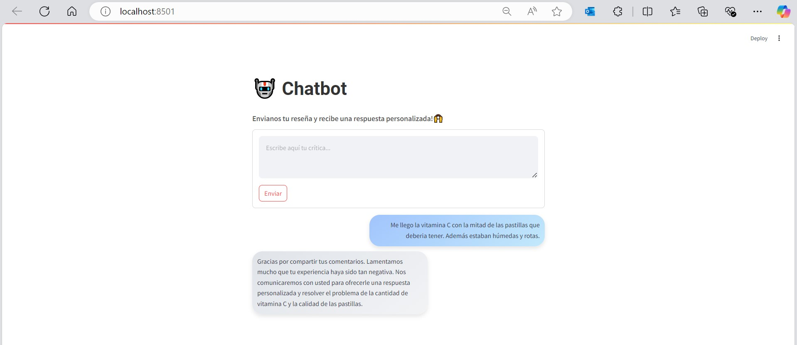
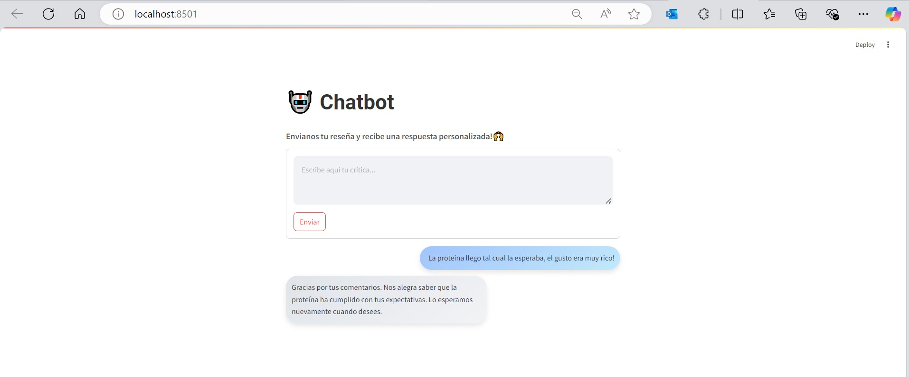

# Chatbot de Suplementos Nutricionales

**Autor:** Dante Larroy  
**Fecha de Entrega:** 02/01/2025

## Resumen

Este proyecto tiene como objetivo desarrollar un chatbot para una tienda online de suplementos nutricionales. El chatbot analizará los comentarios de los usuarios, identificando el sentimiento y el tema, y generará respuestas personalizadas basadas en ese análisis.

## Etapas del Proyecto

1. **EDA y Preprocesamiento de Datos (18/12 - 21/12)**
   - Análisis exploratorio y limpieza de datos.
   - Generación de nube de palabras y análisis de la distribución de sentimientos.

2. **Desarrollo del Modelo de Sentimiento (22/12 - 24/12)**
   - Entrenamiento de un modelo supervisado para análisis de sentimiento.

3. **Desarrollo del Modelo de Clasificación de Tópicos (22/12 - 24/12)**
   - Implementación de un modelo no supervisado para clasificar comentarios por tema.

4. **Desarrollo de la Función IA Generativa (22/12 - 24/12)**
   - Función para generar respuestas personalizadas utilizando el análisis de sentimiento y tema.

5. **Desarrollo FrontEnd (25/12)**
   - Creación de una interfaz gráfica en Streamlit.

6. **Pruebas y Ajustes (26/12 - 02/01)**
   - Validación del modelo y ajustes necesarios.

## Instalación

1. Clona el repositorio:
    ```bash
    git clone https://github.com/tuusuario/supplements-chatbot.git
    cd supplements-chatbot
    ```

2. Instala las dependencias:
    ```bash
    pip install -r requirements.txt
    ```


## Resultado Final

A continuación, se muestra cómo quedó el chatbot en la interfaz de Streamlit (Para probarlo ejecutar el archivo app.py de la carpeta streamlit e instala los requerimientos de esa carpeta):
Respuesta ante crítica Negativa:


Respuesta ante crítica Positiva:



---
